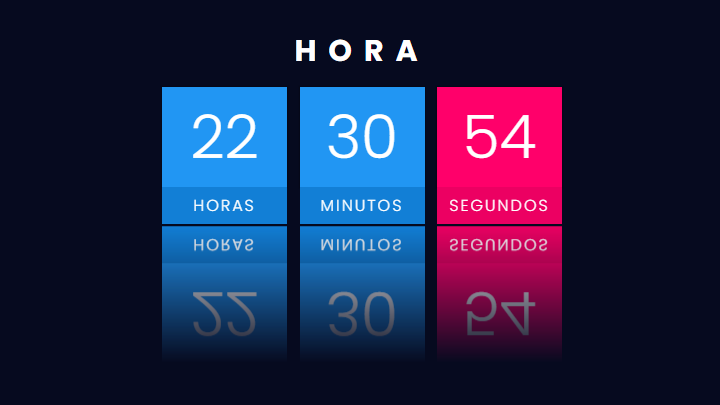

# 
Clock

  <h2>Digital</h2>  
  

<h2>🛠️ Technologies</h2>

  <ul>
    <li><a href="https://git-scm.com/">Git</a></li>
    <li><a href="https://www.w3schools.com/css/">CSS3</a></li>
    <li><a href="https://www.w3schools.com/html/">HTML5</a></li>
    <li><a href="https://www.javascript.com/">JavaScript</a></li>
  </ul>

## Autor

Bruno Silva Santana - <ibrunoss@outlook.com> - <https://github.com/ibrunoss>
